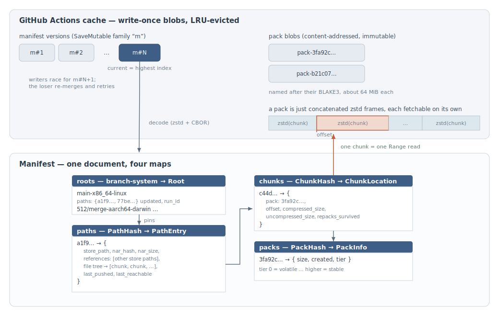

# Architecture

hestia turns the GitHub Actions cache into a Nix binary cache. On paper
that is a poor fit: entries are write-once, keys can never be
overwritten, and anything idle for a week gets evicted. Most of the
design below exists to work around those three constraints.

## Runtime view

One daemon runs per job (`hestia serve`, started by the action's main
step). It speaks to Nix on two channels: a unix socket for paths the
job builds, and an HTTP listener serving the Nix binary cache protocol.

### Serving

The action puts the daemon first in `extra-substituters`, so Nix asks
it before cache.nixos.org. A narinfo hit answers straight from the
manifest. A NAR request is more involved: the daemon fetches the path's
chunks from pack blobs with HTTP Range reads, reassembles the NAR, and
verifies its hash before the first byte leaves the process. Any failure
along the way (evicted pack, missing chunk, hash mismatch) becomes a
404 and Nix quietly falls through to the next substituter; the daemon
would rather serve nothing than something corrupt.

### Pushing

Nix runs `hestia hook` after every successful build; the hook forwards
the built paths over the unix socket and the daemon buffers them in
memory. Uploads happen on drain: the action's post step, the idle
timeout, or SIGTERM. A drain takes the buffered paths plus everything
the substituter served, chunks the new ones, uploads packs, and commits
a new manifest version.

## Storage view

hestia creates only two kinds of cache entry: the manifest, and pack
blobs.

### Manifest

The manifest is a single zstd-compressed CBOR document describing
everything hestia has stored: four maps over paths, chunks, packs, and
GC roots. The wire form is columnar (hash tables plus parallel arrays)
to keep repeated 32-byte hashes from bloating the encoding; the
in-memory form is plain B-tree maps optimized for merging.

The cache is write-once, but the manifest must change. SaveMutable (a
pattern borrowed from go-actions-cache) fakes mutability with a key
sequence `m#1`, `m#2`, …: the highest index is the current version, and
a writer claims the next index by reserving it. When two drains race,
one loses the reservation, reloads the winner's version, merges its own
changes on top, and tries again. All manifest merges are commutative
and idempotent, so the outcome does not depend on who wins.

A `PathEntry` holds what narinfo needs (store path, NAR hash and size,
references) plus the path's file tree, where each file's contents is a
list of chunk hashes (plus a table of reference rewrites -- see below).
Chunk hashes resolve through the `chunks` map to a location: which
pack, at what offset, how many bytes.

### Packs

Store paths are not cached one entry each. NARs are split into
content-defined chunks (FastCDC, 16–256 KiB, 64 KiB average), each
chunk is zstd-compressed individually, and compressed chunks are
concatenated into pack blobs of about 64 MiB. The pack key is the
BLAKE3 of the blob, so identical packs dedup naturally and a finalized
pack can be trusted to match its name. Chunk and pack hashes use BLAKE3
(~3x faster than SHA-256 and unconstrained by any Nix format); NAR
hashes stay SHA-256, since Nix records and verifies those.

This layout buys three things. Chunking dedups across paths and
versions: a rebuilt package shares most of its chunks with the previous
build, so only the changed chunks are new bytes. Per-chunk compression
keeps every chunk independently extractable: serving one path touches
only its chunks, fetched with Range reads, not whole packs. And packing
keeps the entry count low, which matters because both REST list
operations and the eviction clock work per entry.

### Reference normalization

Store paths embed the 32-character base32 hashes of their references
(and their own self-reference) in file contents. When a dependency is
rebuilt its hash changes, so every chunk covering an occurrence churns
even though nothing else in the file changed.

hestia rewrites those occurrences to zeros before chunking, so the
stored chunk stays identical across rebuilds. Each occurrence is
recorded in a per-file position table (`ChunkList::rewrites`: file
offset + reference index); on NAR reassembly the daemon copies the real
hash back into each span. The hashes are not stored twice -- they come
from the path's `references` in the `PathEntry`, and a reference's index
is its position in the sorted, deduplicated reference set, so write and
read derive identical indices.

Restoring from the position table is chosen over re-scanning each served
NAR: a benchmark measured 20-30 GB/s against under 1 GB/s, and it
restores losslessly with no chance of a sentinel colliding with genuine
content. The write side scans each file once to find the occurrences
regardless; recording their offsets during that scan is free.

Restoration keys off whether a file's `rewrites` is non-empty, so
reference-free files pass through untouched (and keep the single-chunk
zero-copy fast path). Correctness is checked, not assumed: the write
pipeline re-derives the NAR hash through the same restore path before
upload, and the substituter re-verifies the full NAR hash before
serving. Any disagreement is a 404, and Nix falls through.

### Roots and GC

What stays alive is decided by roots, one per branch and system (e.g.
`main-x86_64-linux`). Every drain rewrites its root to the paths the
job pushed or accessed. Roots from the same workflow run merge by
union, so matrix legs accumulate into one closure no matter how far
apart they finish; a later run replaces the root, which is what lets
old closures die. The full GC story (mark, sweep, repack, eviction
touching) lives at the top of `src/gc.rs`.

### Crash safety

Order of operations does the heavy lifting. Packs are uploaded before
the manifest version that references them, so a manifest never points
at a blob that was never finalized. A crash between the two leaves an
orphaned pack, which GC's orphan scan deletes later. The reverse
hazard, GitHub evicting a pack the manifest still references, is
handled at read time (404 → next substituter) and reconciled by GC.
