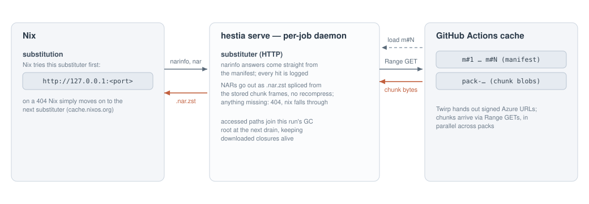
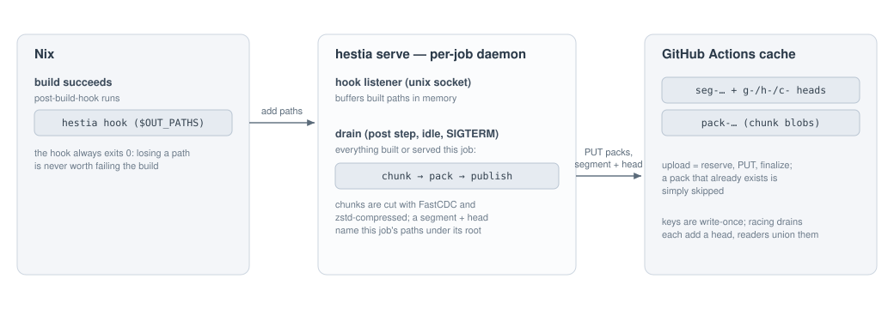
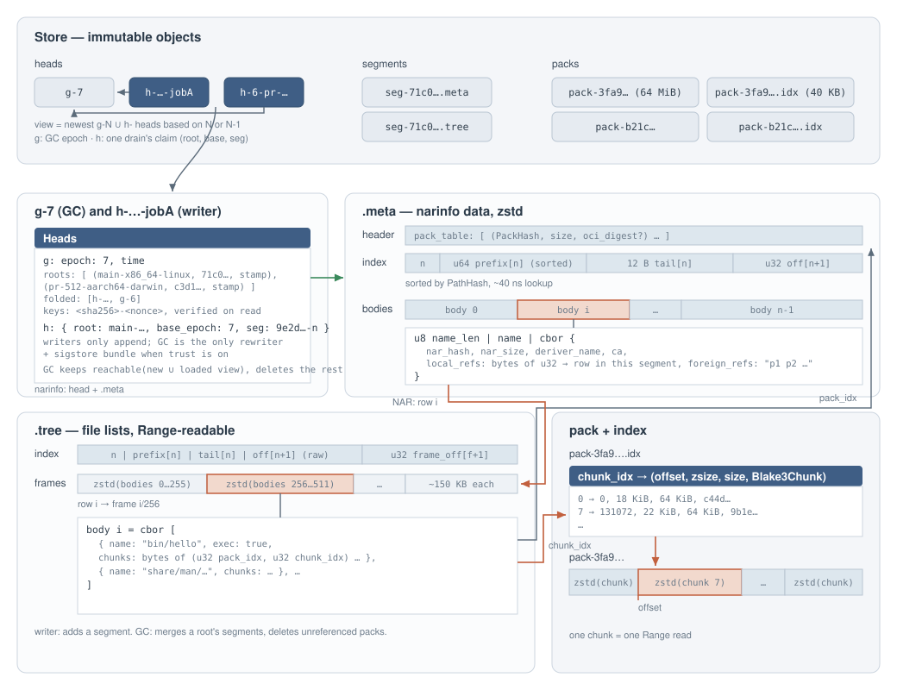

# Architecture

hestia turns the GitHub Actions cache into a Nix binary cache. On paper
that is a poor fit: entries are write-once, keys can never be
overwritten, and anything idle for a week gets evicted. Most of the
design below exists to work around those three constraints.

## Runtime view

One daemon runs per job (`hestia serve`, started by the action's main
step). It speaks to Nix on two channels: a unix socket for paths the
job builds, and an HTTP listener serving the Nix binary cache protocol.

### Serving

The action puts the daemon first in `extra-substituters`, so Nix asks
it before cache.nixos.org. A narinfo hit answers straight from the
segments loaded at startup. A NAR request is more involved: the daemon fetches the path's
chunks from pack blobs with HTTP Range reads, reassembles the NAR, and
verifies its hash before the first byte leaves the process. Any failure
along the way (evicted pack, missing chunk, hash mismatch) becomes a
404 and Nix quietly falls through to the next substituter; the daemon
would rather serve nothing than something corrupt.

### Pushing

Nix runs `hestia hook` after every successful build; the hook forwards
the built paths over the unix socket and the daemon buffers them in
memory. Uploads happen on drain: the action's post step, the idle
timeout, or SIGTERM. A drain takes the buffered paths plus everything
the substituter served, chunks the new ones, uploads packs, and
publishes a segment plus a head naming it.

## Storage view

hestia creates three kinds of cache entry, all write-once: pack blobs
(`pack-<sha256>`, chunk frames followed by their index), segments
(`seg-<sha256>` for the `.meta` part, which names its `tree-<sha256>`),
and heads (`g-*`, `h-*`, `c-*`). Everything but a head is named by the
SHA-256 of its bytes, so the same names work as OCI blob digests.

The same objects go into one of three stores: the Actions cache (the
default, evicts by LRU), an OCI registry (blobs plus one manifest each,
heads as tags) or an S3-compatible bucket (`pack/<xx>/`, `seg/`,
`heads/` under a prefix). The rest of this document is store-agnostic:
a store only needs put, ranged get, list by prefix and delete.

### Segments and heads

A segment is what one writer published for one root: `.meta` holds a
sorted path index, per-path narinfo fields and a pack table with a
live-chunk bitset per pack; `.tree` holds the file trees, where a
file's contents is a list of `(pack row, index in pack)` references
plus reference rewrites (see below). Nothing in a segment is ever
modified, so there is no merge conflict to resolve: concurrent drains
simply publish one segment each.

Which segments make up a root is decided by heads, empty-bodied or
small entries whose *names* carry the claim: `h-<epoch>-<root>-<time>-<seg>`
(a drain added a segment), `c-<epoch>-<root>-<time>-<id>` (a compaction
replaced some), `g-<epoch>-<time>-<id>` (GC rewrote every root). A reader
lists the heads, takes the newest GC record as the base and applies
the drain and compaction heads published since. Between GC runs a busy
root would pile up segments, so a drain that sees several pending folds
them into one and says so with a `c-*` head. Drains elect themselves
for this at random, with odds scaled so that about one per minute wins
however many run concurrently. `docs/spec/segments.qnt`
is the model of these rules.

### Packs

Store paths are not cached one entry each. NARs are split into
content-defined chunks (FastCDC, 16–256 KiB, 64 KiB average), each
chunk is zstd-compressed individually, and compressed chunks are
concatenated into pack blobs of about 64 MiB. The pack key is the
SHA-256 of the blob, so identical packs dedup naturally and a finalized
pack can be trusted to match its name. Chunk hashes use BLAKE3 (the hot
path, ~3x faster and unconstrained by any format).

This layout buys three things. Chunking dedups across paths and
versions: a rebuilt package shares most of its chunks with the previous
build, so only the changed chunks are new bytes. Per-chunk compression
keeps every chunk independently extractable: serving one path touches
only its chunks, fetched with Range reads, not whole packs. And packing
keeps the entry count low, which matters because both REST list
operations and the eviction clock work per entry.

### Reference normalization

Store paths embed the 32-character base32 hashes of their references
(and their own self-reference) in file contents. When a dependency is
rebuilt its hash changes, so every chunk covering an occurrence churns
even though nothing else in the file changed.

hestia rewrites those occurrences to zeros before chunking, so the
stored chunk stays identical across rebuilds. Each occurrence is
recorded in a per-file position table (`ChunkList::rewrites`: file
offset + reference index); on NAR reassembly the daemon copies the real
hash back into each span. The hashes are not stored twice -- they come
from the path's `references` in the `PathEntry`, and a reference's index
is its position in the sorted, deduplicated reference set, so write and
read derive identical indices.

Restoring from the position table is chosen over re-scanning each served
NAR: a benchmark measured 20-30 GB/s against under 1 GB/s, and it
restores losslessly with no chance of a sentinel colliding with genuine
content. The write side scans each file once to find the occurrences
regardless; recording their offsets during that scan is free.

Restoration keys off whether a file's `rewrites` is non-empty, so
reference-free files pass through untouched (and keep the single-chunk
zero-copy fast path). Correctness is checked, not assumed: the write
pipeline re-derives the NAR hash through the same restore path before
upload, and the substituter re-verifies the full NAR hash before
serving. Any disagreement is a 404, and Nix falls through.

### Roots and GC

What stays alive is decided by roots, one per branch and system (e.g.
`main-x86_64-linux`). Every drain publishes a segment naming what the
job pushed, found stored, or substituted. GC compacts each root to the
union of what drains named since its previous run, so matrix legs and
re-runs accumulate while closures no job uses any more die. GC is the
only deleter: it repacks mostly-dead packs, publishes the new GC head
and only then deletes what neither the new view nor the previous one
references (`src/gc.rs`).

### Crash safety

Order of operations does the heavy lifting. Packs are uploaded before
the segment that references them, the segment before its head, so a
head never points at a blob that was never finalized. A crash in
between leaves orphans, which GC deletes once they are older than a
drain could take. The reverse hazard, GitHub evicting a pack a segment
still references, is handled at read time (404 → next substituter) and
by GC dropping the affected entries so the next job pushes them again.
